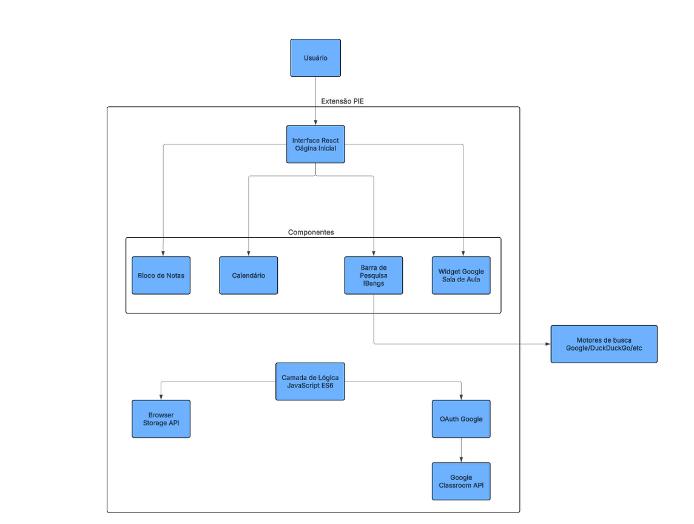

---

# Descrição da Arquitetura:

O **P.I.E.** foi projetado utilizando uma arquitetura em camadas, organizada para separar a interface gráfica, a lógica de negócio e os serviços externos utilizados pela extensão. Camada de Apresentação (*front-end*).
A camada de apresentação é construída utilizando **React com Typescript e CSS3**, sendo responsável pela interface exibida na página inicial do navegador. Ela é composta pelos principais módulos do sistema:

- Bloco de Notas; 
- Calendário Acadêmico; 
- Barra de Pesquisa com suporte a *!bangs*; 
- Widget de integração com o **Google Sala de Aula**. 

Essa organização permite uma interface dinâmica, reutilizável e de fácil manutenção.

---

# Camada de Lógica de Negócio: 

Implementada em **Typescript**, essa camada controla o funcionamento interno da extensão e implementa as regras de negócio do sistema. 
Entre suas responsabilidades estão: 

- Salvar automaticamente as anotações locais (RN02); 
- Processar comandos *!bangs* antes de realizar pesquisas (RN03); 
- Gerenciar eventos do calendário; 
- Controlar a autenticação do usuário para acesso ao Google Sala de Aula (RN01). 

Toda comunicação entre a interface e os serviços externos passa por essa camada.

---

# Camada de Persistência: 

Como o projeto não utiliza um servidor próprio, o armazenamento é realizado utilizando a Browser Storage API (Chrome Storage/Firefox Storage). Nela são armazenados: 

- Anotações do bloco de notas; 
- Eventos do calendário; 
- Atalhos e preferências do usuário. 

Os dados permanecem disponíveis localmente mesmo após o fechamento do navegador.

---

# Serviços Externos:

O sistema realiza integração com a Google Classroom API, permitindo listar atividades abertas, pendentes e concluídas do estudante. O acesso somente é permitido após autenticação via OAuth da conta Google, conforme definido na RN01, garantindo que apenas usuários autorizados possam acessar suas informações acadêmicas. Além disso, o módulo de pesquisa realiza redirecionamentos para motores de busca externos (Google, DuckDuckGo, YouTube, Reddit etc.) utilizando a sintaxe !bangs, processando o comando antes da pesquisa padrão.
